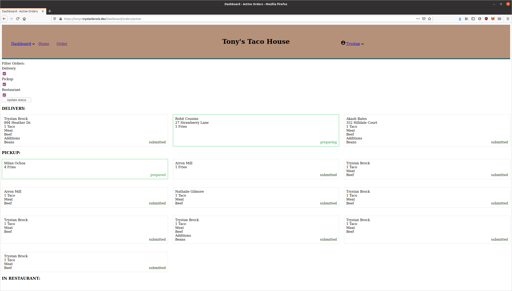
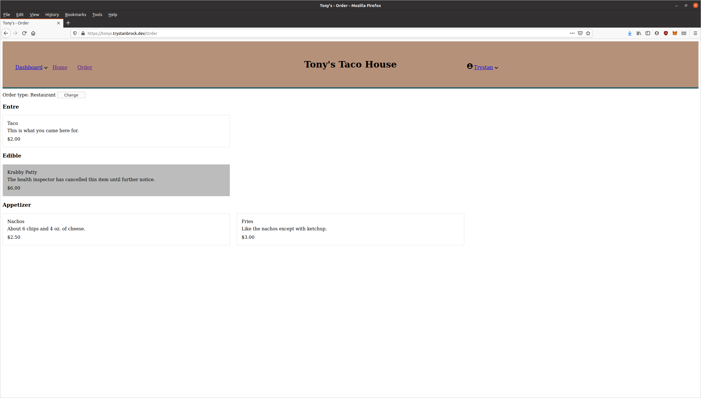

View the source code [here](https://github.com/usdaproved/tonys) and the live website [here](https://tonys.trystanbrock.dev).

## Where to begin?
This is a large project with a lot to cover, I have spent the past year working on this. The only part of it that
 I didn't write myself was the credit card handling. I used Stripe and PayPal, with plans to implement Apple Pay. 
 Other than that I wrote the url routing, I made the database structure, wrote the queries and the PDO handler. 
 I even wrote a program in C that connects to a USB printer and automatically prints out an order when one is submitted. 
At the moment the user interface is not pretty, but it is fully functional.

## Authentication
Using Argon2ID as the password hashing algorithm, users can register knowing their passwords are safely stored.
Employees and customers login through the exact same page. Users are tagged with a __user_type__ in the MySQL database,
defaulting to 0 for customer. For customers, registering is completely optional. The only benefit to registering
is that even after the session ends users can still access their information and from another device.
Otherwise the system treats all users the same.

## The Dashboard
Only privileged users can access the dashboard, owners of the restaurant and employees. Even within the dashboard there
are pages and functions accessible to only admins, a step above employees. Only admins can edit the menu, edit the hours,
and edit whether or not the restaurant is accepting orders for delivery.

When editing the menu, admins have full control down to the position of the item on the menu. Menu items can have choices,
such as type of meat. Items can have required choices or optional choices. Items can also have additions, which are like
optional choices, except they are shared with the entire menu. So admins can create an addition for _extra cheese_ then
they can attach that addition to any item that could come with _extra cheese_. 

The main hub of the dashboard is the active orders page. From this page, without needing to ever refresh, any new orders
will automatically come in. Any changes to these orders will automatically update, if another employee marks it as complete, all
other people viewing the page will see it. All of this functionality was made using vanilla javascript, that goes for the 
entire website, of course. 

Employees can also search users and pull up their information and past orders. Employees can go to a specific order and refund
part or all of it. They can refund it through Stripe if paid by card, or just keep a simple record of cash refunded.

## Placing An Order

On the order page users will choose the order type, delivery or pickup, and they will add items to their cart.
Selecting an item will open up a dialog window where the user will select choices and additions.
The user will also be able to submit a comment along with that line item, such as "no cheese".
After choosing an order type and adding at least one item to the cart, they will be able to move on to the payment.
Customers can pay by entering their credit card number, processed through Stripe, or they can use PayPal. On the
test website I have disabled PayPal as I didn't like how the demo mode was setup, but the webhook is implemented.
Once an order is submitted, an email is sent out from the personal email server I set up.

## Work left to do
This is a large project, over 4500 lines of PHP, but there is so much left to be done. The gap between functional and
production ready is a large one. For starters it needs to look good, minimal effort was put into the design as I
was entirely focused on the back-end and javascript functionality. Additionally, I would really like to fully 
integrate a PoS Terminal to the dashboard, so that the restaurant can have all its needs met by the website.